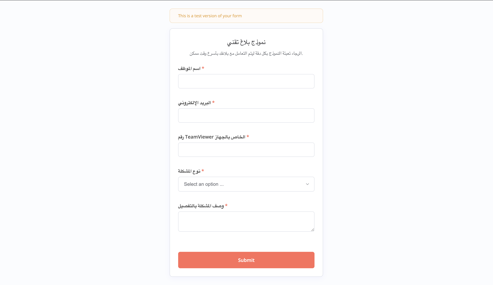
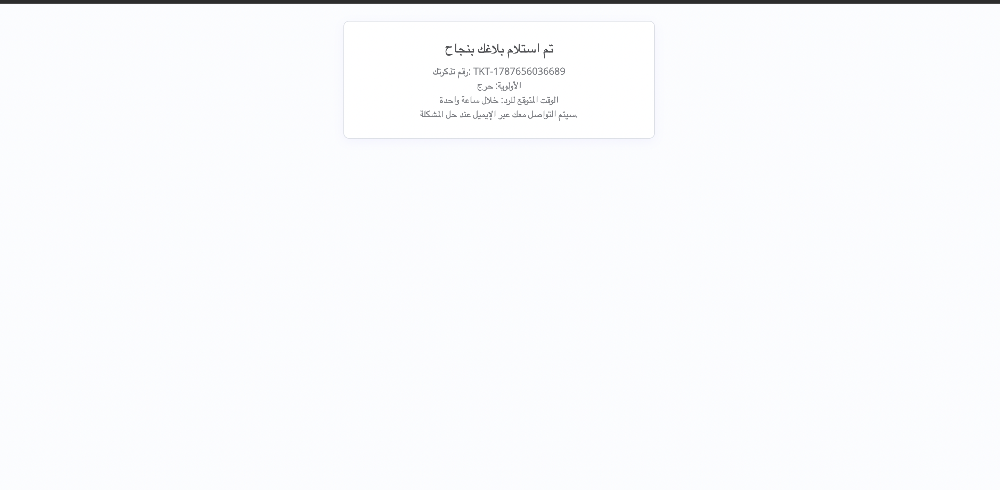
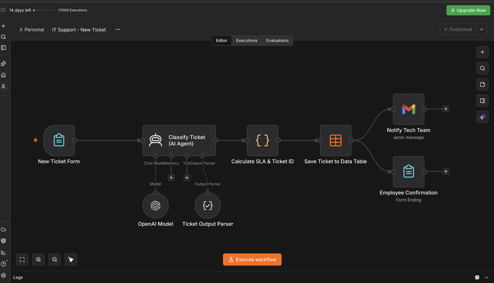
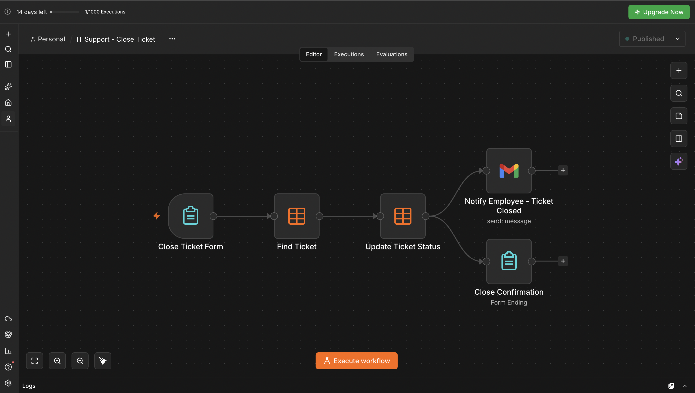
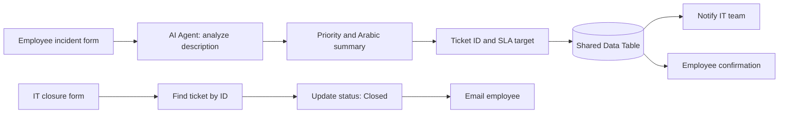

# AI-Powered IT Service Desk

### ITSM | AI Automation | n8n | MVP

An AI-powered IT support ticketing MVP designed to streamline incident reporting, automate ticket classification, and improve communication between employees and the IT support team.

The solution was developed using n8n, OpenAI, Gmail, and n8n Data Tables.

**Project Type:** Personal MVP / Proof of Concept  
**Pilot Scope:** Designed for 25 users  
**Focus Area:** IT Service Management, AI-assisted ticket triage & workflow automation

---

## 1. Project Overview

This project explores how AI and workflow automation can simplify everyday IT support operations.

The MVP was designed for a small pilot group of 25 users, providing a lightweight solution for submitting, classifying, tracking, and closing IT support tickets.

Rather than building a full ITSM platform, the objective was to validate a simplified ticket lifecycle using accessible automation tools.

The solution consists of two main workflows:

1. New Ticket Registration & AI Classification
2. Ticket Resolution & Closure

Both workflows interact with a shared n8n Data Table.

---

## 2. The Core Idea: AI That Understands the Employee's Problem

The key feature is an **AI Agent that reads and interprets the employee's own description of a technical issue**. Rather than forwarding an unstructured message unchanged, the agent uses the issue category and description to suggest a severity level and produce a concise **Arabic technical summary** for IT staff.

This is **AI-assisted triage**, not automatic diagnosis or resolution: a human support specialist still investigates and resolves the incident. The agent's classification depends on the quality of the information submitted.

## 3. Problem Statement

In smaller IT support environments, incidents may be reported through multiple communication channels, such as email, phone calls, and instant messaging.

This can create operational challenges, including:

- Inconsistent incident documentation.
- Difficulty tracking open and closed requests.
- Manual ticket prioritization.
- Limited visibility into incident status.
- Repetitive communication between employees and IT support.

The MVP explores how a centralized reporting form and automated ticket lifecycle can address these challenges.

---

## 4. Project Objectives

The main objectives were to:

- Simplify IT incident reporting.
- Introduce a structured ticket registration process.
- Automatically classify incidents using AI.
- Assign ticket priority based on reported impact.
- Calculate target response deadlines.
- Store incident information in a centralized table.
- Automate notifications to the IT support team.
- Notify employees when their tickets are closed.

The solution was designed as a limited-scope MVP rather than a production-ready enterprise ITSM system.

---

## 5. My Role & Responsibilities

**Role: MVP Developer | ITSM & Workflow Automation**

I designed and developed the MVP based on practical IT support processes and incident management requirements.

My key responsibilities included:

- Identifying opportunities to automate IT support activities.
- Defining the MVP scope and ticket lifecycle.
- Designing the employee incident reporting form.
- Building the automated ticket registration workflow.
- Integrating an AI Agent for incident classification.
- Defining ticket priority levels and SLA targets.
- Configuring the shared ticket data structure.
- Developing the ticket closure workflow.
- Implementing automated email notifications.
- Reviewing the workflow logic and identifying opportunities for improvement.

The project combines practical IT support knowledge with automation and AI capabilities.

---

## 6. MVP Scope

The MVP was designed for a pilot group of 25 users.

### Included Features

- Employee incident submission form.
- AI-based incident classification.
- Automated ticket ID generation.
- Priority assignment.
- SLA target calculation.
- Ticket storage.
- IT team email notifications.
- Ticket closure form.
- Automatic status updates.
- Employee closure notifications.

### Outside the Initial MVP Scope

- Enterprise-level ITSM functionality.
- Full incident analytics dashboard.
- Automated technician assignment.
- Advanced escalation workflows.
- Employee self-service portal.
- SLA monitoring and breach alerts.
- Multi-team approval workflows.

These capabilities could be considered in future development phases.

---

## 7. System Workflow

### Workflow 1: New Ticket Registration

The employee submits an IT incident through a dedicated form.

The form collects:

- Employee name.
- Email address.
- TeamViewer ID.
- Issue category.
- Problem description.

After submission, the system sends the issue information to an AI Agent.

The AI Agent generates:

1. A suggested incident priority.
2. A technical summary of the reported issue.

The workflow then generates a unique ticket ID, calculates an SLA deadline, and saves the ticket in the shared Data Table.

Finally, the IT support team receives an email notification, and the employee receives a confirmation on the form.

### Workflow 2: Ticket Resolution & Closure

After resolving an incident, the IT support team submits the ticket ID and resolution notes through an internal closure form.

The workflow:

1. Searches for the ticket using its ID.
2. Retrieves the ticket information.
3. Updates the ticket status to Closed.
4. Sends a closure notification to the employee.
5. Displays a confirmation message.

---

## 8. AI-Based Ticket Classification

The solution uses an OpenAI GPT-4o mini model integrated into n8n to analyze employee-reported incidents. Its structured output contains `priority` and `ai_summary`, the latter a concise Arabic summary for the support team.

The AI Agent classifies tickets into four priority levels:

| Priority | SLA Target |
|---|---|
| Critical | 1 hour |
| High | 4 hours |
| Medium | 24 hours |
| Low | 72 hours |

These values represent configurable targets used in the MVP. The current implementation calculates deadlines using elapsed hours rather than business-calendar hours; advanced SLA monitoring is outside the initial scope.

AI classification is based on the information submitted by the employee and should not be treated as a verified technical diagnosis.

---

## 9. Technology Stack

| Technology | Purpose |
|---|---|
| n8n | Workflow automation |
| OpenAI | Incident classification and summarization |
| JavaScript | Ticket ID and SLA calculation |
| n8n Data Tables | Ticket storage |
| Gmail | Automated email notifications |
| n8n Forms | Incident submission and closure |

---

## 10. Importing the Demo Workflows

- [New Ticket workflow](workflows/new-ticket-workflow.json)
- [Close Ticket workflow](workflows/close-ticket-workflow.json)
- [Required Data Table structure](docs/data-table-setup.md)

To recreate the demo, create the `IT_Support_Tickets` Data Table, import both workflow JSON files, connect your **own** OpenAI and Gmail credentials, then replace the example IT inbox address in the new-ticket workflow. The JSON exports contain no live credentials or personal mailbox address. They are portfolio examples, not a ready-to-deploy production service.

## 11. Workflow Screenshots

### 1. Employee incident submission form

The employee describes the issue in their own words; the AI Agent uses that description to classify and summarize the ticket.

### 2. Ticket submission confirmation

The employee sees a ticket reference, priority, and response target after submitting the form.

### 3. New ticket and AI analysis workflow

The AI Agent interprets the reported problem, suggests a priority, and produces a technical summary before the ticket is saved and the IT team is notified.

### 4. Ticket closure workflow

The IT team looks up the ticket, marks it closed, and triggers an employee notification.

### Ticket lifecycle

---

## 12. MVP Limitations

The solution was developed as a proof of concept to explore automation opportunities in IT support.

The initial version has several limitations:

- No advanced analytics dashboard.
- No automated ticket assignment.
- No automatic SLA breach alerts.
- No enterprise authentication or role-based access control.
- No full audit trail or reporting functionality.
- Limited error handling.
- No formal production performance evaluation.

The MVP provides a foundation for further experimentation and development.

---

## 13. Future Improvements

Potential future enhancements include:

- A centralized IT support dashboard.
- Ticket status tracking for employees.
- Automated escalation rules.
- SLA breach notifications.
- Technician assignment.
- Power BI reporting.
- Incident trends and performance analysis.
- Expanded pilot testing and user feedback.

---

## 14. Skills Demonstrated

- IT Service Management
- Incident Management
- Workflow Automation
- AI Integration
- Process Improvement
- MVP Development
- Requirements Analysis
- SLA Design
- Ticket Lifecycle Management
- Automation Logic

---

## Project Disclaimer

This project is a personal MVP designed to demonstrate IT support automation concepts.

The 25-user figure represents the intended pilot scope, not a claim of measured production adoption.

The repository contains a portfolio demonstration of the workflow design. Live credential bindings and the original personal IT inbox address have been removed from the published workflow exports. Sample email addresses are placeholders; please configure your own before running.
